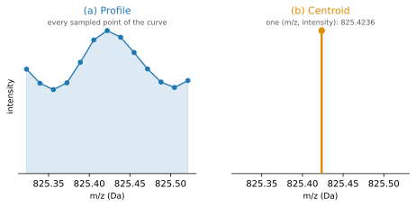
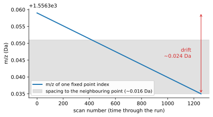
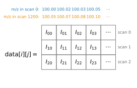
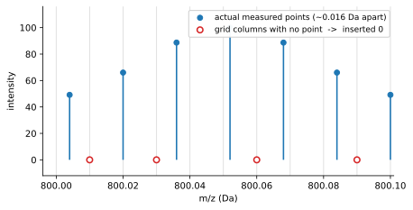
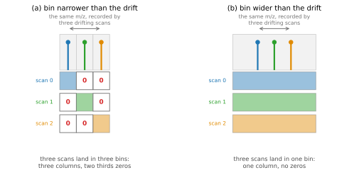
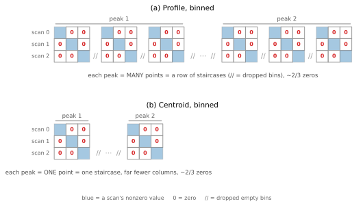
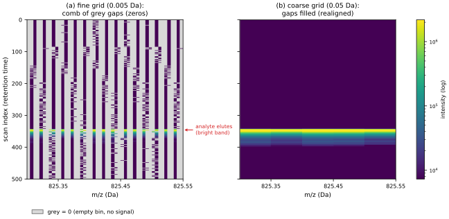

.. _hrms-data-model:

HRMS Profile Data: Why Each Scan Has Its Own m/z
================================================

In an LC-MS experiment, one collects a series of MS spectra as a function of
retention time. In most cases, the data matrix shares a common set of mass
labels. This document covers an exception with Agilent Q-TOF data (MassHunter),
where successive scans often have *different* mass labels. This page explains why
the exception exists, how *rainbow* stores these data, and how to work with the
results.

Some Terminology
----------------

A mass spectrometer reports **intensity** (how much signal was seen) as a
function of *m/z*. One spectrum is a **scan**; a run is a sequence of scans
indexed by ``i``. (You can think of ``i`` as retention time.) Within a scan,
intensity is recorded at ``k`` points, indexed by ``j`` (from 0 to ``k`` - 1);
``k`` is the same in every scan.

Most MS instruments have unit resolution (i.e., 1 Da) and use quadrupoles to
select one *m/z* to pass through at a time. Since the same *m/z* values are selected
on every scan, the array labels (``ylabels``) are the same throughout. In this
document, we will call this **per-array labeling**.

In Q-TOF instruments, each ion is accelerated through the same voltage to give
it the same amount of kinetic energy. Ions of equal charge then separate by mass:
lighter ones travel faster and reach the detector sooner, heavier ones later.
The instrument records intensity against the **flight time** each ion takes,
on a ladder of times fixed by its clock, and *m/z* is *computed* from each flight
time afterward. That computation is redone every scan, so each scan has its own
*m/z* labels. We will call this **per-scan labeling**.

.. note::

   This is the high-resolution data Agilent MassHunter stores in
   :ref:`MSProfile.bin <hrms>`.

Centroid vs profile
-------------------

High-resolution instruments like Q-TOFs create a lot of data, so it is common to
offer two storage options. A **profile** dataset keeps all the
points from each scan, whereas a **centroid** dataset only keeps the peaks. One must
consider the per-array vs. per-scan issue for both dataset formats.

.. _fig-centroid-profile:

   One real Q-TOF peak (``cyan.D``, scan 0), stored two ways. (a) The profile
   keeps every sampled point of the curve; (b) the centroid keeps a single
   ``(m/z, intensity)`` for that same peak.

Why Do Mass Labels Change With Time? Drift.
-------------------------------------------

As batches of ions go through the flight tube, the instrument counts ions on
an evenly spaced ladder of flight times (microseconds). These flight times
are converted to *m/z* ratios by a process called *calibration* (see below).
The calibration changes from scan to scan ("drift"), and thus, the *m/z* labels
are scan-dependent (:numref:`fig-drift`).

.. _fig-drift:

   Drift causes *m/z* labels to be scan-dependent. Because the drift is small
   relative to the flight time spacing, the combs do not overlap.

Calibration functions
----------------------

The conversion from flight time to *m/z* is a **calibration function**, a
polynomial fitted per scan. Its core is a quadratic in the flight time :math:`t`,

.. math::

   m/z \;=\; \bigl(A\,(t - t_0)\bigr)^2 ,

so *m/z* grows with the *square* of the flight time, with two fitted numbers
:math:`A` and :math:`t_0` per scan. A small **polynomial correction** (up to six
more coefficients :math:`c_n`, evaluated with :func:`numpy.polyval`) is then
subtracted on top so the result reproduces the masses Agilent MassHunter reports.
Writing the whole conversion out for scan
:math:`i` at flight time :math:`t_j = \mathrm{tof}[j]`:

.. math::

   \mathrm{mass\_labels}(i)[j]
   \;=\; \bigl(A_i\,(t_j - t_{0,i})\bigr)^2
   \;-\; \sum_{n} c_{n,i}\, t_j^{\,n} .

The flight-time ladder :math:`\mathrm{tof}` is shared by every scan; only the
coefficients :math:`A_i, t_{0,i}, c_{n,i}` belong to a particular scan. So
*rainbow* never stores a full *m/z* value for every point of every scan, which
would be enormous. It keeps the one shared :math:`\mathrm{tof}` array plus each
scan's handful of coefficients and recomputes a scan's *m/z* on demand: small,
exact, and drift is just those coefficients changing from scan to scan.

.. note::

   In practice, the calibration usually changes only a little between scans.
   However, any of the coefficients *could* change, so *rainbow* stores all of
   them.

The data matrix: same index, different m/z
------------------------------------------

With per-scan labels, the intensities are stored as a matrix ``data[i][j]``:

- row ``i`` is the scan
- column ``j`` is the point (one of the ``k`` points in that scan)

The matrix is rectangular, but **a column does not carry a single m/z**
(:numref:`fig-data-matrix`). Each column ``j`` is a fixed *flight time*, but the
per-scan calibration assigns it a different *m/z* in each scan, so ``data[5][j]``
and ``data[1200][j]`` are intensities at *different* masses even though they sit
in the same column.

.. _fig-data-matrix:

   (a) A normal rainbow file: each column **is** an *m/z* (per-array mass labels,
   ``ylabels``), shared by every scan (one colour, repeated above and below the
   matrix). (b) An HRMS profile: columns are a shared flight time ``tof[j]`` and
   the *m/z* is per-scan ``mass_labels(i)`` (the top strip ``mass_labels(0)`` and
   bottom strip ``mass_labels(1200)`` carry different labels), so there is no
   single ``ylabels``.

Reading an HRMS file
--------------------

To read a MassHunter profile dataset:

.. code-block:: python

   import rainbow as rb
   datadir = rb.read("example.D", hrms=True, precision=4)
   profile = datadir.get_file("MSProfile.bin")

This requests the **per-scan** representation (with ``precision=4`` the *m/z*
labels are rounded to four decimals; the default ``precision='auto'`` also picks
four for Q-TOF data). To access those data:

.. code-block:: python

   profile.scan(i)         # -> (m/z array, intensity array) for scan i
   profile.mass_labels(i)  # -> the m/z array for scan i (its own, per scan)
   profile.tof             # the shared flight-time axis (same for every scan)
   profile.data            # the 2-D intensities, shape (num_scans, k)

Note that there is deliberately **no** ``profile.ylabels``. (If you try to access
``ylabels``, you will be scolded.)

If you must have one *m/z* axis
-------------------------------

Per-array mass labels are convenient: one *m/z* axis you can index, slice, and
stack. Per-scan mass labels are faithful: every point on its own correct axis.
What if you want both: one shared axis you can index, that still covers every
point the per-scan form keeps?

The answer is the **common grid**: pass a ``bin_width`` to ``rb.read``:

.. code-block:: python

   import rainbow as rb
   datadir = rb.read("example.D", hrms=True, precision=4, bin_width=0.01)
   profile = datadir.get_file("MSProfile.bin")   # a shared-grid DataFile
   profile.ylabels                               # one m/z axis you can index

Binning is performed as follows:

- lay down a grid of evenly spaced **bins**, each ``bin_width`` wide, across the
  *m/z* range
- drop each scan's intensity into the bin its *m/z* falls in
- **throw away every bin that stayed empty in all scans** (:numref:`fig-binning`)

The surviving bins become the columns: the union of the bins the scans occupied.
(In *rainbow* this is implemented by the ``bin_to_grid`` function in
``rainbow/agilent/masshunter.py``.)

.. _fig-binning:

   Building the common grid. (a) Scan A drops its intensities into 0.01 Da bins.
   (b) Scan B has drifted, filling some of A's bins and some new ones. (c) Stacked
   onto the union: a **shared** bin fills both rows; a **drifted** bin reads 0
   (red) for the scan that missed it; and a bin **empty in every scan** (100.05
   here) is dropped, so it never becomes a column. Shaded boxes represent non-zero
   intensities.

Note that there are **no all-zero columns**. If there is no intensity in a given bin
for any scan, it is dropped. However, there can be many sparse columns. We can see this
effect in ``cyan.D``.

At a fine ``bin_width`` of 0.0001 Da, the scans almost never land in the same bin,
so **every one of the ~315,000 columns holds exactly one nonzero entry** and two thirds
of every row is zero. Coarsening ``bin_width`` pools the drifting scans, trading
resolution for fewer zeros. Once a bin is wider than the drift it catches all the scans
at once, and the zeros vanish (:numref:`fig-realign`).

.. list-table::
   :header-rows: 1
   :widths: 34 33 33

   * - ``bin_width``
     - columns
     - zeros (per row)
   * - 0.0001 Da
     - ~315,000
     - 67%
   * - 0.001 Da
     - ~297,000
     - 65%
   * - 0.01 Da
     - ~147,000
     - 29%
   * - 0.05 Da
     - ~48,000
     - 0%

.. _fig-realign:

   Effectiveness of the common grid. (a) A bin narrower than
   the drift puts the three in separate bins: three columns, two thirds zeros. (b)
   A bin wider than the drift catches all three in one bin: one column, no zeros.

.. note::

   ``bin_width`` is unrelated to ``precision``. ``bin_width`` controls how
   aggressively scans are pooled onto the common grid; ``precision`` only controls
   how the *m/z* labels are rounded. If ``precision`` is too coarse to give every
   bin a distinct label, *rainbow* warns but still bins at the requested
   ``bin_width``.

Centroids
---------

Since centroid data are merely generated from profile data, both formats are
subject to drift, and both bin the same way, producing the same zeros. The only
difference is how many points sit under a peak: a profile spends **many** (a wide
row of staircases, :numref:`fig-centroid-zeros` a), a centroid spends **one** (a
single staircase, :numref:`fig-centroid-zeros` b). Both are about two-thirds
zeros, but the centroid's matrix is far smaller, so binning it is cheap.

.. _fig-centroid-zeros:

   The same two peaks, binned on a fine grid. Every measured point becomes a
   3-column staircase, one bin per scan, and empty bins between are dropped
   (``//``). (a) A profile spends many points on each peak, so each peak is a wide
   row of staircases. (b) A centroid spends one point per peak, so each peak is a
   single staircase, far fewer columns. Both are about two-thirds zeros.

A worked example
----------------

We can now put the pieces together on a real run. ``amber.D`` is a 500-scan
Q-TOF acquisition, windowed to the *m/z* region around 825.42 to keep the fixture
small. Read it per-scan (the default), then bin onto a shared grid, once finely
and once coarsely, and view each as a heatmap:

.. code-block:: python

   import numpy as np
   import matplotlib.pyplot as plt
   from matplotlib.colors import LogNorm
   import rainbow as rb

   # Per-scan (the default): each of the 500 scans keeps its own m/z axis.
   profile = rb.read("tests/inputs/amber.D", hrms=True).get_file("MSProfile.bin")

   # Pass a bin_width to project onto one shared grid (a DataFile with ylabels).
   fine = rb.read("tests/inputs/amber.D", hrms=True,
                  bin_width=0.005).get_file("MSProfile.bin")
   coarse = rb.read("tests/inputs/amber.D", hrms=True,
                    bin_width=0.05).get_file("MSProfile.bin")

   # fine.data / coarse.data are (num_scans, num_bins): plot either as a heatmap.
   grid = fine                                     # or coarse
   cmap = plt.get_cmap("viridis").copy()
   cmap.set_bad("0.85")                            # render the masked zeros as grey
   plt.imshow(np.ma.masked_equal(grid.data, 0),    # mask zeros so the gaps show
              aspect="auto", cmap=cmap, norm=LogNorm(),
              extent=[grid.ylabels[0], grid.ylabels[-1], grid.data.shape[0], 0])
   plt.xlabel("m/z (Da)"); plt.ylabel("scan (retention time)")
   plt.colorbar(label="intensity"); plt.show()

:numref:`fig-worked` shows both grids. On the fine grid each scan samples a comb
of *m/z* positions, so most cells are 0 (grey): the zeros from binning, drifting
slowly down the run. On a grid wider than the drift the comb closes up and the
scans realign. The bright horizontal band is the analyte eluting off the column at
one retention time. Centroids bin the same way but are far sparser
(:numref:`fig-centroid-zeros`).

.. _fig-worked:

   ``amber.D`` (a 500-scan Q-TOF run) binned near *m/z* 825.42, as heatmaps: rows
   are scans (retention time), columns are *m/z*, log colour is intensity, and
   **grey is 0**. (a) A fine grid (0.005 Da) leaves a comb of grey gaps, the
   zeros. (b) A grid wider than the drift (0.05 Da) fills them in (realigned). The
   bright band is the analyte eluting.
