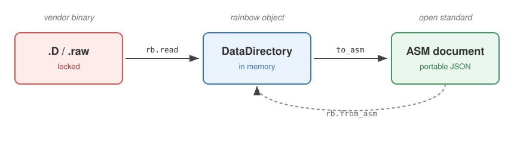

.. _asm:

Open data: the Allotrope Simple Model
=====================================

Reading the binaries is half the goal. The other half is getting the data into
a form that outlives the vendor's software. The **Allotrope Simple Model** (ASM)
is an open, JSON-based community standard for analytical data. Where rainbow
frees the data from the vendor's binary, ASM frees it from rainbow: a document
that any ASM-aware tool can read, long after the instrument and its software are
gone.

rainbow moves data into ASM, and back out of it, in both directions and at two
scales: a single run, or a whole sequence.

         to an ASM JSON document with to_asm, and reads it back with from_asm.
   :align: center
   :width: 90%

   rainbow moves a run out of the vendor binary, into an open ASM document, and
   back again.

Quick start
-----------

Read a run, then call :code:`to_asm` for the document as a dict, or
:code:`export_asm` to write it straight to a file. This works for any
:code:`DataDirectory`, whether it came from an Agilent :code:`.D` or a Waters
:code:`.raw`:

.. code-block:: python

   import rainbow as rb

   datadir = rb.read("Caffeine.D")           # or rb.read("Caffeine.raw")
   datadir.export_asm("Caffeine.asm.json")   # write the file
   document = datadir.to_asm()               # the same document, as a dict

A whole sequence exports the same way from a :code:`DataSequence`, as one
document with a shared device system and one liquid chromatography document per
injection:

.. code-block:: python

   sequence = rb.read_sequence("Caffeine_Stability", peaks=True)
   sequence.export_asm("Caffeine_Stability.asm.json")

And both directions reverse, reconstructing rainbow objects from a document:

.. code-block:: python

   import json

   datadir = rb.from_asm(json.load(open("Caffeine.asm.json")))
   sequence = rb.sequence_from_asm(json.load(open("Caffeine_Stability.asm.json")))

What exports is driven by the detector, not the vendor, for any run rainbow
reads, Agilent or Waters. UV channels (absorbance chromatograms and diode-array
spectra) export faithfully; SIM MS exports every monitored ion as a mass
chromatogram, and a full scan's ions export on request via :code:`ions=[...]`;
CAD, ELSD, and FID export faithfully under their own measures, and RID alone on
an interim basis. An FID makes the run a gas-chromatography document. See
:ref:`asm-detectors` for the full map. The multi-injection sequence workflow is Agilent-only, because
:code:`rb.read_sequence` reads the Agilent sequence sidecars.

.. _asm-size:

Controlling document size
-------------------------

ASM stores every number as text, so a document is several times larger than the
packed binary it came from, and a diode-array (DAD) spectrum cube,
retention-time by wavelength, dwarfs everything else. A whole sequence bundles
one such cube per injection, so a long run can reach gigabytes. Three arguments,
accepted by both :code:`to_asm` and :code:`export_asm` (single run or
sequence), trade fidelity for size:

.. list-table::
   :header-rows: 1
   :widths: 34 66

   * - Argument
     - Effect
   * - ``export_dad_cube=False``
     - Drop the multi-wavelength DAD spectrum cube entirely; single-wavelength
       chromatograms still export. The single biggest reduction.
   * - ``wavelengths=[254, 280]``
     - Keep only these wavelengths of the DAD cube (nearest available, in nm),
       instead of the full spectrum.
   * - ``decimal_places=4``
     - Round every emitted number (signals, retention times, peak metrics) to
       this many places.

.. code-block:: python

   # Just the 254 and 280 nm traces, rounded to 4 places: a fraction of the size.
   datadir.export_asm("Caffeine.asm.json",
                      wavelengths=[254, 280], decimal_places=4)

   # Or drop the spectrum cube altogether, keeping the chromatograms.
   sequence.export_asm("Caffeine_Stability.asm.json", export_dad_cube=False)

Prefer :code:`export_asm` over :code:`to_asm` when writing to disk: it streams
the document one injection at a time, so even a multi-gigabyte sequence never has
to fit in memory as a single string.

For a long sequence, :code:`per_injection=True` writes one standalone document
per injection into a directory instead of a single bundled file, and returns the
paths written:

.. code-block:: python

   paths = sequence.export_asm("Caffeine_Stability_asm", per_injection=True)

Quick reference
---------------

.. list-table::
   :header-rows: 1
   :widths: 45 55

   * - Call
     - Result
   * - ``datadir.to_asm()`` / ``.export_asm(path)``
     - one run as an ASM document
   * - ``sequence.to_asm()`` / ``.export_asm(path)``
     - a whole sequence as one ASM document
   * - ``rb.from_asm(document)``
     - a DataDirectory rebuilt from ASM
   * - ``rb.sequence_from_asm(document)``
     - a DataSequence rebuilt from ASM

Read on
-------

The pages below go deeper:

.. toctree::
   :titlesonly:

   The standard <asm/the-standard>
   Concepts <asm/concepts>
   Agilent <asm/agilent>
   Waters <asm/waters>
   Detectors <asm/detectors>
   Reading ASM back <asm/roundtrip>
