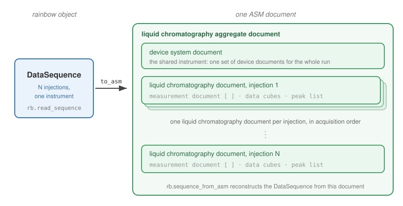

.. _asm-agilent:

Agilent to ASM
==============

Agilent is the most complete ASM export path: single runs and whole sequences,
with the richest metadata envelope, because the Agilent formats carry the
instrument, method, and injection detail that fills it.

Formats
-------

rainbow reads three Agilent containers, and all three export the same way:

- **ChemStation** ``.D`` directories (classic LC and LC-MS).
- **MassHunter** ``.D`` directories.
- **OpenLab** ``.dx`` archives (a zipped ``.D``, read in place).

Single runs come from any of these. Whole **sequences** are Agilent-only,
because :code:`rb.read_sequence` reads the Agilent sequence sidecars
(``sequence.acaml`` and the per-injection ``acq.macaml`` / ``SAMPLE.XML``); see
:ref:`sequences` for that workflow.

.. code-block:: python

   import rainbow as rb

   datadir = rb.read("Caffeine.D")            # or "Caffeine.dx"
   datadir.export_asm("Caffeine.asm.json")

Detectors
---------

All of Agilent's detectors export: UV, CAD, ELSD, SIM MS, and FID faithfully,
RID as an interim. The schema has no cube for a full scan's retention-by-m/z
surface, so a full scan is exported only when you name the ions of interest, each
pulled out as its own mass chromatogram:

.. code-block:: python

   # extract two ions from a full scan as mass chromatograms
   datadir.export_asm("Caffeine.asm.json", ions=[195, 138])

An FID channel routes the whole run to a gas chromatography document. The
technique is read from the method's sample inlet (``Sample Inlet : GC`` in
``acqmeth.txt``), with an FID-presence fallback; force it with ``technique=``:

.. code-block:: python

   datadir.export_asm("Caffeine.asm.json", technique="GC")

See :ref:`asm-detectors` for the per-detector cubes and measures.

Metadata mapping
----------------

What rainbow reads from an Agilent run fills the ASM envelope as follows:

.. list-table::
   :header-rows: 1
   :widths: 40 60

   * - rainbow metadata
     - ASM field
   * - ``instrument`` modules (name, model, serial, firmware)
     - device documents in the device system document, each with a ``device
       type``
   * - ``vendor`` (``Agilent``)
     - each device's ``product manufacturer``
   * - ``sample``
     - the measurement's ``sample identifier``
   * - ``vialpos``
     - the sample's ``location identifier``
   * - ``date``
     - the measurement time and the injection time, converted from the vendor
       spelling to ISO 8601 (see :ref:`asm-timestamps`)
   * - ``injection_volume``
     - the injection document's autosampler volume setting (uL stored as mm^3)
   * - ``operator``
     - the liquid chromatography document's ``analyst``
   * - ``wavelength`` (per channel)
     - the detector control's wavelength setting

The instrument modules map to real Allotrope device types: a diode-array
detector, a pump, an autosampler, and a column compartment each become a device
document with its model number, serial number, and firmware version. A module
whose kind rainbow cannot identify still gets a valid generic ``device`` type
rather than being dropped.

Sequences
---------

A sequence read exports as one ASM document: a single device system document for
the shared instrument, then one liquid chromatography document per injection, in
acquisition order. Peaks read with :code:`peaks=True` become each injection's
processed data.

         document and one liquid chromatography document per injection.
   :align: center
   :width: 95%

   A whole Agilent sequence becomes one ASM document.

.. code-block:: python

   sequence = rb.read_sequence("Caffeine_Stability", peaks=True)
   sequence.export_asm("Caffeine_Stability.asm.json")

The instrument identity (module serial and firmware numbers, the operator)
survives best when the sequence has a top-level ``sequence.acaml``; without one,
rainbow falls back to the per-injection module detail so the device system still
names the hardware, if only by model. See :ref:`sequences` for how peaks are
read and joined to their injections.

A diode-array sequence can produce a very large document, since every
injection's full spectrum cube is text. To keep it manageable, drop or thin the
spectrum cube, round the numbers, or write one file per injection; see
:ref:`asm-size`.

.. code-block:: python

   # one standalone document per injection, just two wavelengths, 4 places
   sequence.export_asm("Caffeine_Stability_asm", per_injection=True,
                       wavelengths=[254, 280], decimal_places=4)

A worked example
----------------

.. code-block:: python

   import rainbow as rb

   datadir = rb.read("Caffeine.D")
   document = datadir.to_asm()

   aggregate = document["liquid chromatography aggregate document"]
   lc_document = aggregate["liquid chromatography document"][0]
   measurements = lc_document["measurement aggregate document"]["measurement document"]

   print(len(measurements), "exported channels")
   for measurement in measurements:
       sample = measurement["sample document"]["sample identifier"]
       cube = (measurement.get("chromatogram data cube")
               or measurement["three-dimensional ultraviolet spectrum data cube"])
       print(measurement["measurement identifier"], sample, cube["label"])

Each measurement carries its sample identifier, its detector control, and a data
cube. Read it straight back with :code:`rb.from_asm`; see :ref:`asm-roundtrip`.
