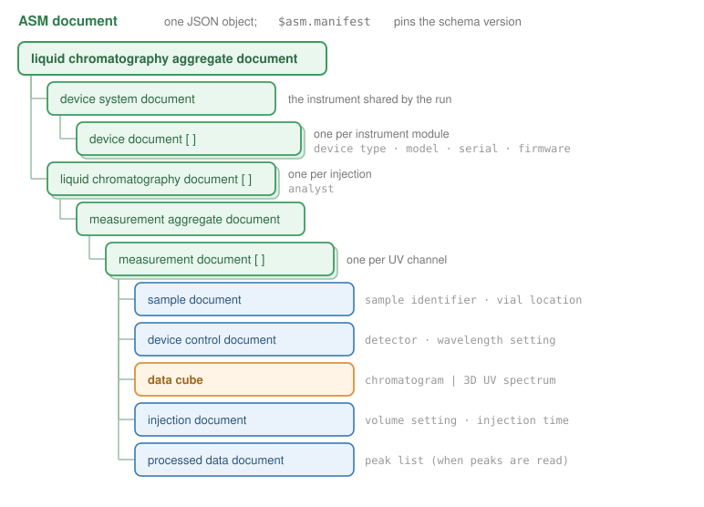
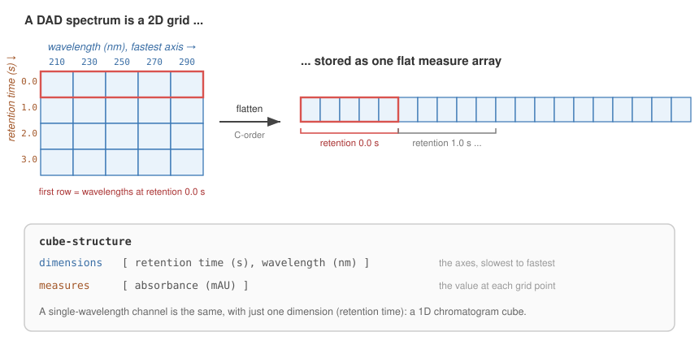

.. _asm-concepts:

Concepts: the document and the data cube
========================================

An ASM document is a nested set of named objects. This page is a map of those
names, each tied to what rainbow puts there, followed by the one structure worth
understanding in detail: the data cube.

The document tree
-----------------

         document down to per-channel measurement documents, data cubes, and
         processed-data peak lists.
   :align: center
   :width: 95%

   The liquid-chromatography document tree that :code:`to_asm` emits.

Reading from the top down:

**liquid chromatography aggregate document**
   The root. Everything lives under it, alongside the ``$asm.manifest`` that
   pins the schema version. It holds one device system document and a list of
   liquid chromatography documents.

**device system document**
   The instrument. Carries an ``asset management identifier`` (the instrument
   name) and one **device document** per hardware module. rainbow fills these
   from the modules it reads: each gets a ``device type`` (an AFO class such as
   ``diode array detector`` or ``pump``), and, when known, a ``model number``,
   ``product manufacturer``, ``equipment serial number``, and ``firmware
   version``. A run with no module detail falls back to a single bare ``liquid
   chromatograph`` device.

**liquid chromatography document**
   One injection. A single run produces one of these; a sequence produces one
   per injection, in acquisition order. It names the ``analyst`` and wraps a
   measurement aggregate document.

**measurement document**
   One detector channel. rainbow emits one per exported channel (every UV
   channel, plus the other detectors). This is where a signal and its
   context come together:

   - **sample document** with the ``sample identifier`` and, when present, the
     vial ``location identifier``.
   - **device control document** naming the detector (``ultraviolet detector``)
     and its ``detector wavelength setting``.
   - the **data cube** itself (see below), keyed either ``chromatogram data
     cube`` or ``three-dimensional ultraviolet spectrum data cube``.
   - **injection document** with the ``autosampler injection volume setting
     (chromatography)`` and injection time, when the volume is known.
   - **processed data aggregate document** carrying the **peak list**, when the
     run was read with peaks.

**$asm.manifest**
   Not part of the tree, but the field that makes the document self-describing:
   the URL of the exact schema version this document claims to conform to. See
   :ref:`asm-the-standard`.

A quick glossary
----------------

.. list-table::
   :header-rows: 1
   :widths: 38 62

   * - ASM term
     - What rainbow puts there
   * - aggregate document
     - the top-level container for a whole document
   * - device system document
     - the instrument, as a list of device documents
   * - device document
     - one instrument module (detector, pump, autosampler, column compartment)
   * - device type
     - the module's AFO class (a controlled term, not free text)
   * - measurement document
     - one detector channel: its data cube plus sample, device, and injection
   * - sample document
     - the injected sample's identifier and vial location
   * - injection document
     - the injection volume setting and injection time
   * - data cube
     - the signal itself, as dimensions and measures (below)
   * - processed data document
     - derived results; for rainbow, the integrated peak list
   * - peak
     - one integrated peak: retention, start, end, area, height, symmetry

How a data cube is structured
-----------------------------

A **data cube** is how ASM stores a measured signal. It has two parts: a
``cube-structure`` that names the axes and the measured quantity, and a ``data``
block holding the actual numbers.

- **dimensions** are the independent axes you sampled along (retention time;
  for a diode-array spectrum, retention time and wavelength).
- **measures** are the values recorded at each point on that grid (absorbance).

Each dimension and measure declares its AFO ``concept``, its QUDT ``unit``, and
a ``@componentDatatype``. rainbow records retention time in **seconds** (it
stores minutes internally and converts on the way out), wavelength in **nm**,
and absorbance in **mAU**.

A single-wavelength channel is one-dimensional: retention time in, absorbance
out. A diode-array spectrum is two-dimensional, a grid of (retention time,
wavelength). ASM stores the measure values as one flat array, so the grid is
flattened with **wavelength varying fastest** (C order), which is exactly how
the values sit in memory:

         a single C-order array, with wavelength varying fastest, described by
         cube-structure dimensions and measures.
   :align: center
   :width: 95%

   A diode-array spectrum's grid flattened into one C-order measure array.

A chromatogram is the one-dimensional case of the same machinery. Concretely:

.. code-block:: json

   {
     "chromatogram data cube": {
       "label": "DAD1A.ch",
       "cube-structure": {
         "dimensions": [
           {"concept": "retention time", "unit": "s", "@componentDatatype": "double"}
         ],
         "measures": [
           {"concept": "absorbance", "unit": "mAU", "@componentDatatype": "double"}
         ]
       },
       "data": {
         "dimensions": [[0.0, 0.2, 0.4, "..."]],
         "measures": [[1.4, 1.6, 2.1, "..."]]
       }
     }
   }

The spectrum cube is the same, with a second ``wavelength`` dimension and a
single flat ``measures`` array spanning the whole grid. Because the structure is
fully self-described, :code:`rb.from_asm` can read either one straight back into
a rainbow ``DataFile``; see :ref:`asm-roundtrip`.
