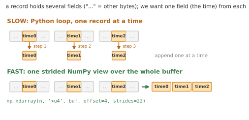
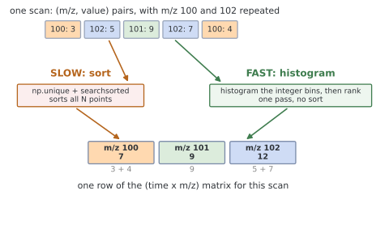
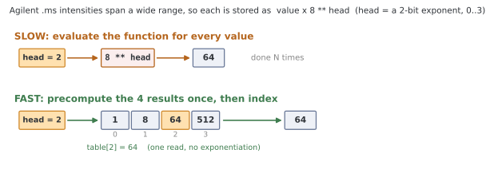
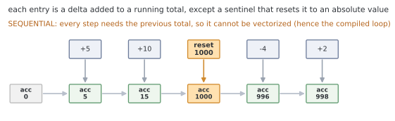

.. _performance:

Performance
===========

Reading a file is cheap; the time goes into the *decode loops* that turn an
encoded byte stream into numbers. A few strategies come up again and again
across the parsers. Parsing a test corpus of about a thousand real Agilent and
Waters runs took 53 seconds before this work and 5.5 seconds after it, roughly
10x faster overall. Most of that comes from the compiled decode loops, which run
about 100x faster than the pure-Python versions; the other strategies make up
the rest. Here they are, with the places they are used, the data they operate
on, and a sense of what each is worth.

Read the file once, then view it as arrays
------------------------------------------

Binary formats usually store their records at a fixed *stride* (a constant byte
gap from one record to the next), so a field at a fixed offset within every
record is just a *strided view*: a NumPy array laid directly over the bytes that
steps by the stride to read the same field from each record, with no Python loop
and no per-record ``struct.unpack``. Suppose each record is 22 bytes with a
little-endian ``uint32`` time at offset 4, and we want every record's time. The
records sit back to back, the time a fixed offset inside each:

.. code-block:: python

    # slow: one read and one unpack per record
    times = []
    for _ in range(n):
        rec = f.read(22)
        times.append(struct.unpack_from('<I', rec, 4)[0])

    # faster: read once, unpack from memory (no per-record syscalls)
    buf = f.read(22 * n)
    times = [struct.unpack_from('<I', buf, i * 22 + 4)[0] for i in range(n)]

    # fastest: no Python loop at all, one strided view over the bytes
    buf = f.read(22 * n)
    times = np.ndarray(n, '<u4', buf, offset=4, strides=22)

The fastest form decodes a large block in a single C-level pass. Values packed
into a few bits inside a larger integer come out the same way: read the packed
integers as one array and split them with ``>>`` and ``&`` over the whole column.

Pulling one field out of a few hundred thousand records this way runs about 90x
faster than the Python loop. In *rainbow*, the Agilent ``OL`` ``.uv`` decoder
(``decode_uv_array``) reads its retention-time by wavelength block of doubles as
one strided view, roughly 30x faster end to end once the rest of its per-scan
work is counted. The ``.ms`` decoder (``parse_ms``) and the Waters ``_FUNC.DAT``
decoders read their fixed-width segments the same way.

Bin with an integer histogram, not a sort
-----------------------------------------

A scan's spectrum is a flat list of ``(label, value)`` pairs that has to become
a ``(retention time, label)`` matrix, summing duplicate labels within a scan.
The obvious approach sorts every data point, and that sort dominates on large
files. When the labels are already quantized (rounded *m/z*, integer
wavelengths) the sort is avoidable: map each label to an integer bin, mark which
bins occur with a boolean *presence* mask, and turn each present bin into its
column with a running count (a ``cumsum``). The values then add straight into the
matrix. One linear pass, no sort.

Because the m/z are integers, those columns come from a histogram (mark which
bins occur, then rank them) rather than a sort.

.. code-block:: python

    # slow: np.unique sorts every pair to find the columns
    ylabels = np.unique(labels)
    cols = np.searchsorted(ylabels, labels)

    # fast: a presence mask + running count finds the columns, no sort
    bins = labels.astype(np.int64) - labels.min()
    present = np.zeros(bins.max() + 1, dtype=bool)
    present[bins] = True                     # which bins occur
    ylabels = present.nonzero()[0] + labels.min()
    cols = (np.cumsum(present) - 1)[bins]     # each present bin -> its column

    # either way, the summing is the same scatter-add into the matrix:
    np.add.at(matrix, (rows, cols), values)

This came up often enough to factor out. ``rainbow._binning.bin_datapairs`` is
shared by the Waters ``_FUNC.DAT`` decoders and the Agilent ``.ms`` decoders
(``parse_ms`` and ``parse_ms_partial``), and the MassHunter ``MSProfile.bin``
grid is built the same way. Dropping the sort speeds the binning step up by
about an order of magnitude (12x on a large spectrum: 800k peaks across 2000
scans, 54 ms down to 4 ms).

Precompute tiny bit-field math into a lookup table
--------------------------------------------------

Compact binary formats often store a value as a small number times a power, to
cover a wide dynamic range in few bytes. An Agilent ``.ms`` intensity, for
instance, is a small value scaled by ``8 ** head``, where ``head`` is a 2-bit
exponent field. The
scale factor depends only on that 2-bit field, so it has just four possible
values: compute them once into a small array and index it, rather than running
``numpy.power`` over the whole column.

.. code-block:: python

    # head is a 2-bit field, so 8 ** head is one of {1, 8, 64, 512}

    # slow: a power over every element of the column
    scale = 8 ** head

    # fast: a four-element table, indexed by the field
    _POW8 = np.array([1, 8, 64, 512], dtype=np.uint32)
    scale = _POW8[head]

*rainbow* uses this for the Agilent ``.ms`` intensity scale (the 2-bit field
above) and the Waters 6-byte ``_FUNC.DAT`` decode, which scales *m/z* by
``2 ** e`` and intensities by ``4 ** e`` from 5- and 4-bit fields
(``_FUNC6_KEY_POW2`` and ``_FUNC6_VAL_POW4``). The tables make that decode about
2x faster.

Compile the loops you cannot vectorize
--------------------------------------

Some decoders are irreducibly sequential. The Agilent ``.uv`` and ``.ch`` signals,
for instance, are *delta-encoded*: each value is stored as a small difference
from the one before, which the decoder adds onto a running total. A delta is only
a few bits, so it cannot represent a large jump; when the data needs one (or needs
to re-anchor the stream), the format writes a reserved marker value, a *sentinel*,
that means "this is not a delta, the next few bytes are an absolute value, use it
as the new running total." The MassHunter ``MSProfile.bin`` run-length decode is
sequential for a similar reason. Each step needs the previous total, so there is
no array form, and the only lever left is to take the Python interpreter out of
the inner loop with a small compiled extension.

.. code-block:: python

    # the pure-Python inner loop: a running total with a sentinel reset
    acc = 0
    for _ in range(n):
        delta = read_int16(buf)
        if delta == SENTINEL:
            acc = read_int32(buf)   # absolute value, not a delta
        else:
            acc += delta
        out.append(acc)

The same loop in Cython is plain C on machine integers and a raw byte buffer:

.. code-block:: cython

    # cython: boundscheck=False, wraparound=False

    def decode(const unsigned char[::1] buf, Py_ssize_t n):
        out_arr = np.empty(n, dtype=np.int64)
        cdef long long[::1] out = out_arr      # write into a preallocated array
        cdef Py_ssize_t off = 0, i
        cdef long long acc = 0                 # the accumulator stays a C int
        cdef short delta
        for i in range(n):
            delta = <short>((buf[off] << 8) | buf[off + 1])   # big-endian int16
            off += 2
            if delta == SENTINEL:
                acc = (<int>((buf[off] << 24) | (buf[off + 1] << 16)
                             | (buf[off + 2] << 8) | buf[off + 3]))
                off += 4
            else:
                acc += delta
            out[i] = acc
        return out_arr

The speed comes from a few specific changes, not cleverness. ``buf`` is a typed
memoryview, so ``buf[off]`` is a direct memory read rather than a Python
``__getitem__``. ``acc`` and ``delta`` are C integers, so the running total never
boxes into a Python ``int`` and back on every iteration. Results go straight
into a preallocated NumPy array through a typed memoryview, with no per-element
``append``. And ``boundscheck=False`` / ``wraparound=False`` turn off the
automatic per-access index checks; *rainbow* keeps explicit ``off + k <= n``
guards instead, so a truncated stream still fails safely rather than reading out
of bounds. Same logic, no interpreter left in the loop.

This is the one *rainbow* reaches for most: three times so far, each on the
order of 100x faster than the pure-Python loop above (measured at 80x for the
``.ch`` delta decode and 105x for the ``MSProfile.bin`` run-length decode).

- ``_uvdelta.pyx``: the Agilent diode-array ``.uv`` delta decode.
- ``_chdelta.pyx``: the Agilent ``.ch`` channel (CAD/ELSD/UV) delta decode.
- ``_msprofile.pyx``: the MassHunter ``MSProfile.bin`` run-length decode.

Each follows the same shape. It is **optional**: the build compiles it when a C
compiler and Cython are present and silently skips it otherwise, so a missing
extension never breaks an install (prebuilt PyPI wheels include them). It has a
**pure-Python twin** that runs when the extension is absent, with identical
output; check which path is live with, e.g.,
``rainbow.agilent.chemstation._chdelta_fast is not None``. And it is held to
**bit-identical output** by ``tests/test_accelerator.py``, which compares the
two paths on every fixture and checks the compiled path fails safely on
truncated input rather than reading out of bounds.

One measurement note, since these loops are where it bites: ``cProfile``'s
per-call overhead makes a million-iteration byte loop look far heavier than it
runs in practice, so confirm a hotspot against wall-clock before deciding it is
worth compiling.
